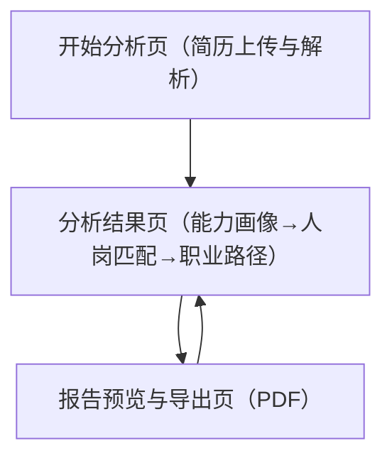

## 1. Product Overview
面向求职者的简历分析与职业规划工具：从简历上传解析出能力画像，进行人岗匹配与职业路径推荐，并汇总生成可下载的 PDF 报告。
帮助你更快看清“我是谁、适合什么岗位、下一步怎么走”，降低求职与转型决策成本。

## 2. Core Features

### 2.1 User Roles
| 角色 | 注册方式 | 核心权限 |
|------|----------|----------|
| 访客用户 | 无需注册（按次使用） | 可上传简历、生成能力画像、进行人岗匹配、查看职业路径推荐、生成并下载 PDF 报告 |

### 2.2 Feature Module
我们的需求由以下核心页面组成：
1. **开始分析页（简历上传与解析）**：简历上传、解析结果预览与修正、分析偏好填写、发起分析。
2. **分析结果页（能力画像→人岗匹配→职业路径）**：能力画像展示、人岗匹配结果、职业路径推荐、生成报告入口。
3. **报告预览与导出页（PDF）**：报告内容汇总预览、生成 PDF、下载 PDF。

### 2.3 Page Details
| Page Name | Module Name | Feature description |
|-----------|-------------|---------------------|
| 开始分析页（简历上传与解析） | 简历上传 | 上传简历文件（PDF/DOC/DOCX），展示上传进度与基础校验（格式/大小失败提示）。 |
| 开始分析页（简历上传与解析） | 简历解析 | 触发解析并展示解析状态；输出结构化信息预览（如基础信息、教育、经历、技能关键词）。 |
| 开始分析页（简历上传与解析） | 信息修正 | 允许你对关键字段进行补充/修正（例如目标岗位/行业、工作年限、核心技能标签），作为后续匹配与推荐输入。 |
| 开始分析页（简历上传与解析） | 分析偏好 | 填写偏好（例如目标城市/行业/岗位方向），用于匹配排序与路径推荐。 |
| 开始分析页（简历上传与解析） | 发起分析 | 点击开始后进入分析结果页，并在失败时给出可重试提示。 |
| 分析结果页（能力画像→人岗匹配→职业路径） | 能力画像 | 生成并展示能力画像（维度分数/等级、证据来源要点）；支持查看各维度的简历依据摘要。 |
| 分析结果页（能力画像→人岗匹配→职业路径） | 人岗匹配 | 基于你的目标方向输出岗位匹配列表（匹配度、关键差距、补齐建议）；支持切换/调整目标岗位方向并重新计算。 |
| 分析结果页（能力画像→人岗匹配→职业路径） | 职业路径推荐 | 输出短/中/长期职业路径（阶段目标岗位、关键能力与项目建议）；与能力差距联动给出优先级。 |
| 分析结果页（能力画像→人岗匹配→职业路径） | 报告生成入口 | 将当前分析结果一键带入报告预览与导出页。 |
| 报告预览与导出页（PDF） | 报告预览 | 汇总展示报告章节（个人概览、能力画像、人岗匹配、职业路径、行动计划清单）。 |
| 报告预览与导出页（PDF） | PDF 生成与下载 | 生成 PDF 并提供下载；生成失败时展示原因与重试入口。 |

## 3. Core Process
**访客用户流程**：
1) 进入开始分析页，上传简历文件。
2) 系统解析简历并输出结构化预览；你可修正关键字段并补充偏好。
3) 提交后生成能力画像，并基于能力画像进行人岗匹配，输出匹配度、差距与建议。
4) 系统给出短/中/长期职业路径推荐，并与差距建议联动形成行动计划。
5) 进入报告预览页确认内容，生成并下载 PDF 报告。

