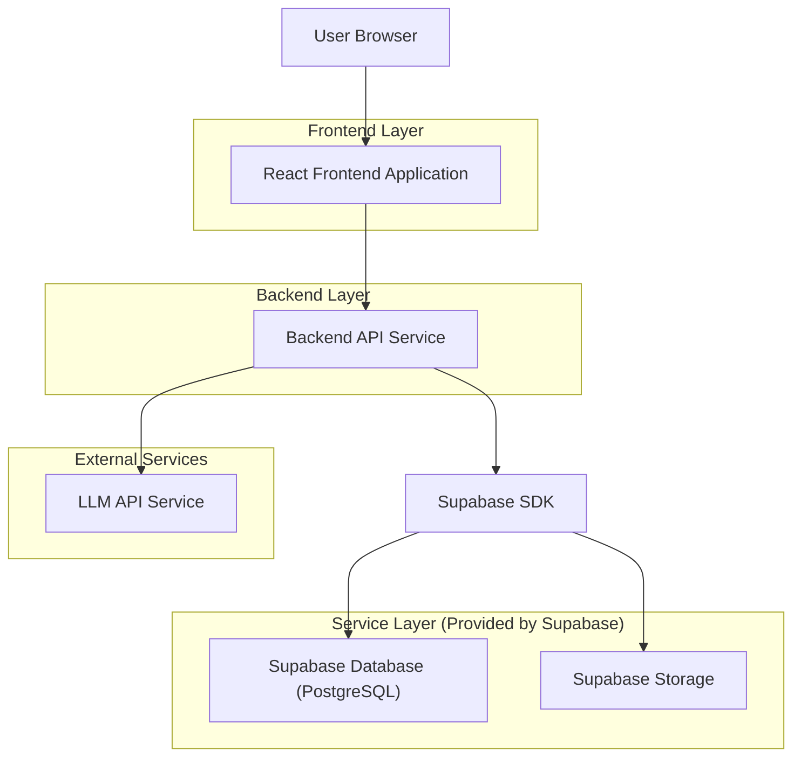
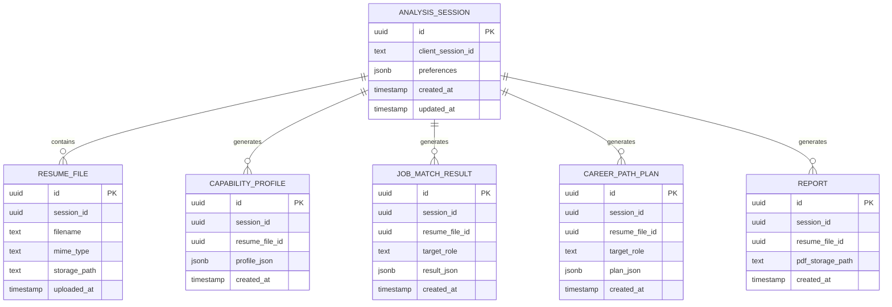

## 1.Architecture design


## 2.Technology Description
- Frontend: React@18 + vite + tailwindcss@3
- Backend: Node.js + Express@4 + TypeScript
- Database: Supabase (PostgreSQL)
- Object Storage: Supabase Storage（存放简历原文件、生成的 PDF）
- AI: LLM API（用于简历结构化解析、能力画像抽取、匹配与路径推荐）
- PDF: Playwright（服务端渲染 HTML 模板并导出 PDF）

## 3.Route definitions
| Route | Purpose |
|-------|---------|
| / | 开始分析页：上传简历、解析预览、补充偏好并发起分析 |
| /analysis | 分析结果页：能力画像、人岗匹配、职业路径推荐 |
| /report | 报告预览与导出页：汇总内容、生成并下载 PDF |

## 4.API definitions (If it includes backend services)

### 4.1 Core Types (TypeScript)
```ts
export type ResumeFile = {
  id: string;
  filename: string;
  mimeType: string;
  storagePath: string;
  uploadedAt: string;
};

export type ResumeParsedData = {
  basic: {
    name?: string;
    email?: string;
    phone?: string;
    city?: string;
    yearsOfExperience?: number;
  };
  education: Array<{ school?: string; degree?: string; major?: string; start?: string; end?: string }>;
  experiences: Array<{ company?: string; title?: string; start?: string; end?: string; highlights?: string[] }>;
  skills: string[];
  rawTextExcerpt?: string; // 仅用于可解释性展示的摘要
};

export type CapabilityDimension = {
  key: string; // e.g. "backend", "data", "product", "communication"
  name: string;
  score: number; // 0-100
  level: "L1" | "L2" | "L3" | "L4" | "L5";
  evidence: string[]; // 来自简历的证据要点
};

export type CapabilityProfile = {
  summary: string;
  dimensions: CapabilityDimension[];
  strengths: string[];
  risks: string[]; // 主要短板/风险提示
};

export type MatchRequest = {
  targetRole: string; // 你选择的目标岗位方向
  preferences?: { city?: string; industry?: string };
};

export type JobMatchItem = {
  roleName: string;
  matchScore: number; // 0-100
  fitReasons: string[];
  gaps: Array<{ gap: string; priority: "P0" | "P1" | "P2"; suggestion: string }>;
};

export type CareerStage = {
  horizon: "short" | "mid" | "long"; // 短/中/长期
  targetRole: string;
  durationMonths: number;
  milestones: string[];
  learningPlan: Array<{ item: string; priority: "P0" | "P1" | "P2" }>;
};

export type CareerPathPlan = {
  positioning: string; // 你的当前定位
  stages: CareerStage[];
};

export type ReportMeta = {
  id: string;
  pdfStoragePath: string;
  createdAt: string;
};
```

### 4.2 Core API
#### Upload resume
```
POST /api/resume/upload
```
Request: multipart/form-data

Response:
| Param Name| Param Type  | Description |
|-----------|-------------|-------------|
| file | ResumeFile | 已上传文件信息 |

#### Parse resume to structured data
```
POST /api/resume/parse
```
Request:
| Param Name| Param Type  | isRequired  | Description |
|-----------|-------------|-------------|-------------|
| resumeFileId | string | true | 已上传简历文件 ID |

Response:
| Param Name| Param Type  | Description |
|-----------|-------------|-------------|
| parsed | ResumeParsedData | 解析结果 |

#### Build capability profile
```
POST /api/profile/build
```
Request:
| Param Name| Param Type  | isRequired  | Description |
|-----------|-------------|-------------|-------------|
| resumeFileId | string | true | 简历文件 ID |
| parsedPatch | Partial<ResumeParsedData> | false | 你在前端修正/补充的字段 |

Response:
| Param Name| Param Type  | Description |
|-----------|-------------|-------------|
| profile | CapabilityProfile | 能力画像 |

#### Job matching
```
POST /api/match
```
Request:
| Param Name| Param Type  | isRequired  | Description |
|-----------|-------------|-------------|-------------|
| resumeFileId | string | true | 简历文件 ID |
| profile | CapabilityProfile | true | 能力画像 |
| match | MatchRequest | true | 匹配目标与偏好 |

Response:
| Param Name| Param Type  | Description |
|-----------|-------------|-------------|
| items | JobMatchItem[] | 匹配结果列表 |

#### Career path recommendation
```
POST /api/career-path
```
Request:
| Param Name| Param Type  | isRequired  | Description |
|-----------|-------------|-------------|-------------|
| resumeFileId | string | true | 简历文件 ID |
| profile | CapabilityProfile | true | 能力画像 |
| targetRole | string | true | 目标岗位方向 |

Response:
| Param Name| Param Type  | Description |
|-----------|-------------|-------------|
| plan | CareerPathPlan | 职业路径方案 |

#### Generate PDF report
```
POST /api/report/generate
```
Request:
| Param Name| Param Type  | isRequired  | Description |
|-----------|-------------|-------------|-------------|
| resumeFileId | string | true | 简历文件 ID |
| profile | CapabilityProfile | true | 能力画像 |
| matches | JobMatchItem[] | true | 匹配结果 |
| plan | CareerPathPlan | true | 职业路径 |

Response:
| Param Name| Param Type  | Description |
|-----------|-------------|-------------|
| report | ReportMeta | 报告元信息（含 PDF 存储路径） |

#### Download report
```
GET /api/report/:id/download
```
Response: application/pdf

## 6.Data model(if applicable)

### 6.1 Data model definition


### 6.2 Data Definition Language
Analysis sessions (analysis_sessions)
```
CREATE TABLE analysis_sessions (
  id UUID PRIMARY KEY DEFAULT gen_random_uuid(),
  client_session_id TEXT NOT NULL,
  preferences JSONB DEFAULT '{}'::jsonb,
  created_at TIMESTAMPTZ DEFAULT NOW(),
  updated_at TIMESTAMPTZ DEFAULT NOW()
);

CREATE INDEX idx_analysis_sessions_client_session_id ON analysis_sessions(client_session_id);
CREATE INDEX idx_analysis_sessions_created_at ON analysis_sessions(created_at DESC);
```

Resume files (resume_files)
```
CREATE TABLE resume_files (
  id UUID PRIMARY KEY DEFAULT gen_random_uuid(),
  session_id UUID NOT NULL,
  filename TEXT NOT NULL,
  mime_type TEXT NOT NULL,
  storage_path TEXT NOT NULL,
  uploaded_at TIMESTAMPTZ DEFAULT NOW()
);

CREATE INDEX idx_resume_files_session_id ON resume_files(session_id);
```

Capability profiles (capability_profiles)
```
CREATE TABLE capability_profiles (
  id UUID PRIMARY KEY DEFAULT gen_random_uuid(),
  session_id UUID NOT NULL,
  resume_file_id UUID NOT NULL,
  profile_json JSONB NOT NULL,
  created_at TIMESTAMPTZ DEFAULT NOW()
);

CREATE INDEX idx_capability_profiles_session_id ON capability_profiles(session_id);
CREATE INDEX idx_capability_profiles_resume_file_id ON capability_profiles(resume_file_id);
```

Job match results (job_match_results)
```
CREATE TABLE job_match_results (
  id UUID PRIMARY KEY DEFAULT gen_random_uuid(),
  session_id UUID NOT NULL,
  resume_file_id UUID NOT NULL,
  target_role TEXT NOT NULL,
  result_json JSONB NOT NULL,
  created_at TIMESTAMPTZ DEFAULT NOW()
);

CREATE INDEX idx_job_match_results_session_id ON job_match_results(session_id);
CREATE INDEX idx_job_match_results_resume_file_id ON job_match_results(resume_file_id);
```

Career path plans (career_path_plans)
```
CREATE TABLE career_path_plans (
  id UUID PRIMARY KEY DEFAULT gen_random_uuid(),
  session_id UUID NOT NULL,
  resume_file_id UUID NOT NULL,
  target_role TEXT NOT NULL,
  plan_json JSONB NOT NULL,
  created_at TIMESTAMPTZ DEFAULT NOW()
);

CREATE INDEX idx_career_path_plans_session_id ON career_path_plans(session_id);
CREATE INDEX idx_career_path_plans_resume_file_id ON career_path_plans(resume_file_id);
```

Reports (reports)
```
CREATE TABLE reports (
  id UUID PRIMARY KEY DEFAULT gen_random_uuid(),
  session_id UUID NOT NULL,
  resume_file_id UUID NOT NULL,
  pdf_storage_path TEXT NOT NULL,
  created_at TIMESTAMPTZ DEFAULT NOW()
);

CREATE INDEX idx_reports_session_id ON reports(session_id);
CREATE INDEX idx_reports_resume_file_id ON reports(resume_file_id);
```

Permissions (recommended baseline)
```
-- 若未来增加登录，可按 Supabase 常见基线授予权限
GRANT SELECT ON analysis_sessions TO anon;
GRANT SELECT ON resume_files TO anon;
GRANT SELECT ON capability_profiles TO anon;
GRANT SELECT ON job_match_results TO anon;
GRANT SELECT ON career_path_plans TO anon;
GRANT SELECT ON reports TO anon;

GRANT ALL PRIVILEGES ON analysis_sessions TO authenticated;
GRANT ALL PRIVILEGES ON resume_files TO authenticated;
GRANT ALL PRIVILEGES ON capability_profiles TO authenticated;
GRANT ALL PRIVILEGES ON job_match_results TO authenticated;
GRANT ALL PRIVILEGES ON career_path_plans TO authenticated;
GRANT ALL PRIVILEGES ON reports TO authenticated;
```
